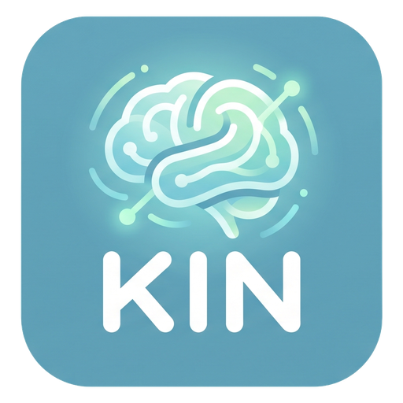

<div id="top"></div>

[![Contributors][contributors-shield]][contributors-url]
[![Forks][forks-shield]][forks-url]
[![Stargazers][stars-shield]][stars-url]
[![Issues][issues-shield]][issues-url]
[![MIT License][license-shield]][license-url]


<!-- PROJECT LOGO -->
<br />
<div align="center">
  <a href="https://github.com/ock666/Kin-CRM">
    
  </a>

  <h3 align="center">Kin</h3>

  <p align="center">
    remember your people, not the pressure
    <br />
    <a href="https://github.com/ock666/Kin-CRM"><strong>Explore the docs »</strong></a>
    <br />
    <br />
    <a href="https://github.com/ock666/Kin-CRM/issues">Report Bug</a>
    ·
    <a href="https://github.com/ock666/Kin-CRM/issues">Request Feature</a>
  </p>
</div>


<!-- TABLE OF CONTENTS -->
<details>
  <summary>Table of Contents</summary>
  <ol>
    <li>
      <a href="#about-the-project">About The Project</a>
      <ul>
        <li><a href="#built-with">Built With</a></li>
      </ul>
    </li>
    <li>
      <a href="#getting-started">Getting Started</a>
      <ul>
        <li><a href="#prerequisites">Prerequisites</a></li>
        <li><a href="#installation">Installation</a></li>
      </ul>
    </li>
    <li><a href="#configuration">Configuration</a></li>
    <li><a href="#features">Features</a></li>
    <li><a href="#roadmap">Roadmap</a></li>
    <li><a href="#contributing">Contributing</a></li>
    <li><a href="#license">License</a></li>
    <li><a href="#contact">Contact</a></li>
    <li><a href="#acknowledgments">Acknowledgments</a></li>
  </ol>
</details>


<!-- ABOUT THE PROJECT -->
## About The Project

Kin is a self-hosted relationship manager built by and for neurodivergent brains — designed to help with AuDHD (Autism + ADHD), Rejection Sensitive Dysphoria (RSD), social anxiety, and overwhelm.

It handles the remembering, the nudging, and the structure of staying in touch — so you can focus on the people, not the pressure.

### Why Kin exists

Kin was born from a lived need. I'm Skye — a 30-year-old trans woman in Brisbane, Australia, living with AuDHD, RSD, and high social anxiety.

Relationships can be exhausting when the social world doesn't come with an instruction manual: one ambiguous reply turns into hours of rumination, "you should reach out more" lands as guilt instead of a lifeline, and overwhelm makes even remembering a friend's birthday feel like a chore.

Kin is the gentle external brain I built to cope. It remembers what I can't always hold onto, gives me a safe sounding board when confusion or RSD takes over, and helps me regulate and make sense of the social world instead of dreading it. Every design choice — the soft nudges, the human-in-the-loop AI, the freedom to snooze or step back — comes from what actually helps me.

I hope it can help others too.

### Design philosophy

- **Gentle, never punitive.** Check-in reminders are soft "needs watering" nudges, not guilt-inducing overdue alarms. Everything is snoozable. Nothing shouts.
- **Human-in-the-loop AI.** AI writes suggestions; you review and approve. Nothing is applied to a profile or sent anywhere without your explicit click.
- **Low barrier to capture.** One big text box. Minimal required fields. Cross-tag people in one entry. Brain dump first, organise later.
- **Visual-first.** Avatar grids, tag colours, water meters — built for brains that balk at dense spreadsheets and long forms.
- **No lock-in.** Full JSON/CSV export, local SQLite database, data stays on your server. Leave anytime with everything.
- **AuDHD/RSD-first.** Designed around the realities of executive dysfunction, rejection sensitivity, and social anxiety before anything else.
- **Cosy by default.** A warm "evening lamp" interface — dim backgrounds, soft wide shadows, a faint amber glow — with every animation reduced-motion-aware.

<p align="right">(<a href="#top">back to top</a>)</p>


### Built With

* [FastAPI](https://fastapi.tiangolo.com/)
* [SQLite](https://www.sqlite.org/)
* [HTMX](https://htmx.org/)
* [Alpine.js](https://alpinejs.dev/)
* [Docker](https://www.docker.com/)
* [APScheduler](https://apscheduler.readthedocs.io/)
* [Jinja2](https://jinja.palletsprojects.com/)
* [Immich](https://immich.app)
* [OpenAI / Ollama](https://ollama.com)

<p align="right">(<a href="#top">back to top</a>)</p>


<!-- GETTING STARTED -->
## Getting Started

Kin runs as a single Docker container with a local SQLite database. No external services are required — everything lives on your hardware.

### Prerequisites

* Docker and Docker Compose
* (Optional) An Immich server for photo integration
* (Optional) An OpenAI API key or a local Ollama server for AI features

### Installation

1. Clone the repo
   ```sh
   git clone https://github.com/ock666/Kin-CRM.git kin && cd kin
   ```
2. Copy the example environment file
   ```sh
   cp .env.example .env
   ```
3. Start the container
   ```sh
   docker compose up -d --build
   ```
4. Open `http://localhost:8000` and follow the setup wizard to create your admin account.

#### Install on Unraid (Community Applications)

Kin-CRM is published to the Unraid Community Applications store from this repository (`ca_profile.xml` + `templates/kin-crm.xml`).

- **In the Unraid Community Apps tab, search for `Kin`, `Kin-CRM`, or `personal crm`** (under **Productivity**).
- The official template points at `ghcr.io/ock666/kin-crm:latest` and installs with app data in `/mnt/user/appdata/kin-crm` mapped to `/data` inside the container.
- If a listing built by a third party shows up first, prefer the one whose **Support/Project** links point to `github.com/ock666/Kin-CRM` — the author's listing is the source of truth.

Your data lives in the Docker volume at `/mnt/user/appdata/personal-crm_kin_data` mapped to `/data` inside the container — a SQLite database plus any cached Instagram session files. Back it up like any other volume, or export from the in-app Export page anytime.

### Development

```sh
python -m venv .venv && source .venv/bin/activate
pip install -r requirements.txt
DATA_DIR=./data uvicorn app.main:app --reload
```

### Running tests

```sh
pip install -r requirements.txt -r requirements-dev.txt
pytest
```

152 tests covering auth, people, journal, export, reviews, settings, push, gamification, conflict resolution, chat, birthdays, quick replies, resolution plans, achievements, retention, grace mode, and more.

<p align="right">(<a href="#top">back to top</a>)</p>


<!-- CONFIGURATION -->
## Configuration

| Variable | Default | Description |
|---|---|---|
| `DATA_DIR` | `/data` | Where the SQLite DB + uploads live inside the container |
| `TZ` | `UTC` | Server timezone (affects daily job scheduling) |
| `DISABLE_SCHEDULER` | `0` | Set to `1` for testing |
| `SESSION_SECRET` | auto-generated | Persisted to `/data/.session_secret` on first run |
| `DATABASE_URL` | (SQLite) | Optional Postgres connection string |
| `ALLOWED_HOSTS` | `localhost,127.0.0.1` | Comma-separated hostnames this server accepts. Set to `*` or your domain in production. |
| `HTTPS_ONLY` | `0` | Set to `1` to restrict session cookies to HTTPS only (requires a TLS-terminating reverse proxy). |

### Behind a reverse proxy

Kin serves HTTP on port 8000 and is designed to sit behind a TLS-terminating reverse proxy (nginx, Caddy, Traefik, Cloudflare Tunnel). The container runs with `--proxy-headers` so it correctly reads `X-Forwarded-*` headers. CSRF protection compares origin/referer hosts only (scheme-agnostic) so it works whether TLS is terminated at the proxy or handled end-to-end.

Push notifications require HTTPS in the browser, so a reverse proxy is mandatory if you want push to work.

### Connecting Immich

1. In Immich, go to Account Settings → API Keys and create a key.
2. In Kin, go to Settings → Immich, enter your server URL and API key, then *Test connection*.
3. On a person's profile, click *Link Immich face* to associate them with a recognized face.

### Connecting AI

Kin works fully without AI — it's purely additive. In Settings → AI assistant, configure:

- **API base URL**: `https://api.openai.com/v1` (OpenAI) or `http://ollama:11434/v1` (Ollama)
- **API key**: your OpenAI key (Ollama doesn't validate this)
- **Primary model**: `gpt-4o-mini` for summaries, fact extraction, birthday drafts, conversation starters, quick replies, bio blurbs, gift ideas
- **Support chat model**: `gpt-4o` for the conflict support chat and resolution plan generation (a more capable model is recommended for the counselling role)

All AI output is a suggestion you explicitly approve or dismiss — nothing is written to a profile automatically.

### Instagram integration (use with caution)

Kin includes an optional, unofficial Instagram reader using [instagrapi](https://github.com/subzeroid/instagrapi). It's against Instagram's Terms of Service. Use a throwaway/secondary account only — never your primary account. Nothing is ever posted or messaged. Posts land in the Review Queue for your approval. Leave it disabled if you'd rather not risk it; everything else works fine without it.

<p align="right">(<a href="#top">back to top</a>)</p>


<!-- FEATURES -->
## Features

### Today dashboard
- **Upcoming birthdays & notable dates** surfaced as they approach with configurable lead time
- **"Time to reach out"** — gentle cadence nudges with per-person quick reply ideas (AI-generated from profile data or template fallback)
- **Grace mode** — pause all nudges and push notifications for a week, no reason needed
- **"On this day"** Immich photo memories widget
- **Hangout detection** — when a linked Immich face shows up in a photo from the last month, a "Looks like you hung out" card appears. It auto-credits the check-in, offers one-click "Quick log" or a pre-filled "Write about it" journal entry (with the photos attached), dedupes against photos already on the person's timeline, and is dismissible
- **"Read back when anxious"** — your own reassurance note plus recently unlocked achievements

### People & relationships
- Rich profiles: birthday, how-you-met, pronouns, relationship label, location, contact info, occupation, hobbies, AI bio blurb
- **Friend rank**: a live-computed completeness score (0-100) that gently nudges filling in missing fields — "not yet known: their birthday", never guilt
- **"Needs watering" cadence meter** — a plant metaphor (healthy / getting dry / needs watering / dormant) instead of an overdue red alert
- **Tag circles**: group people by tag into colour-coded circles (family, work, friends) with visual headers
- **Relationship states** (system-suggests, user confirms): *In conflict* (auto-derived from unresolved conflict logs), *Wants space*, *Drifted* — each softens or suppresses reach-out nudges and push notifications
- **Scratchpad**: fleeting "bring up next time" reminders pinned on the person's profile
- **Notable people**: lightweight references to people in their life without full CRM profiles
- **Notable dates**: anniversaries, kids' birthdays, recurring dates

### Journal: quick-capture logging
- One text box. Optional title, date, location, energy cost (low/medium/high), event type
- Energy cost tracking for planning social bandwidth over time
- Cross-tag people in one entry — appears on all their timelines
- Attach Immich photos via inline browser
- AI auto-extracts tags, notable dates, and follow-up reminders — you review and apply

### Conflict resolution (RSD-aware)
- Log something that felt off — no urgency, no pressure to act
- **"Talk it through"**: persistent, streaming support chat with an AI counsellor (gpt-4o). Preloaded with conflict summary and relationship context. Validates first, helps you work through feelings and arrive at a logical understanding
- **Resolution plan**: auto-generated structured guide (summary, feelings, goal, ordered steps, copy-paste messages, boundary scripts, release option) after chat idle
- **RSD grounding check**: "what are the facts vs. what's the story anxiety is telling me?"
- Release path: "Letting this go" is a first-class, equally valid outcome — not a fallback
- Chat transcripts auto-archive after 14 days ("water under the bridge"), always exportable

### Gamification (celebrating rest too)
- Shared household-wide XP, levels, and 45+ achievements
- **Rest achievements**: celebrate snoozing a check-in, entering grace mode, releasing a conflict, setting "wants space" — rest is productive
- Achievements unlock silently; toasts only for level-ups or new badges

### AI assistant (optional, bring-your-own-key)
- **Conversation starters**: "what to talk about" tailored from journal history
- **Quick reply scripts**: copy-paste icebreakers per person (dashboard and profile)
- **Profile summaries** and **bio blurbs**
- **Birthday message drafts** and **gift ideas** — pre-approved, nothing auto-sent
- **Chat insight → journal**: save key takeaways from support chats

### Regulation toolkit
- Sidebar `🧘 Regulation` link — always accessible, zero AI, no pressure
- 5-4-3-2-1 grounding, box breathing (interactive countdown), facts-vs-RSD reality check, physical grounding
- Inclusive help lines: AU (000, Lifeline, Beyond Blue, QLife), US (988, Trevor Project, Trans Lifeline), UK (999/111, Mind, Switchboard) — secular and queer-affirming only

### PWA: install anywhere
- Install as a standalone app (mobile or desktop) via the PWA manifest
- Opt-in aggregated push notifications — quiet, never spammy, silenced during grace mode
- Offline-first: app shell caches and works without a connection

### Data ownership
- Full JSON export (people, journal, tags, conflicts, chat transcripts, resolution plans, gift ideas, Instagram posts, settings)
- CSV export (people + journal)
- JSON/CSV import (get-or-create by name, non-destructive)
- All data in a local SQLite database (or Postgres if you prefer)

<p align="right">(<a href="#top">back to top</a>)</p>


<!-- ROADMAP -->
## Roadmap

- [x] Today dashboard: birthdays, notable dates, reach-out nudges
- [x] Quick-capture journaling with cross-tagging, energy cost, photo attachments
- [x] Friend rank, water-cadence meter, tag circles, relationship states
- [x] Conflict resolution: support chat (gpt-4o), resolution plans, RSD grounding
- [x] Gamification: XP, levels, achievements including rest badges
- [x] AI assist: summaries, starters, quick replies, gap questions, birthday drafts, gift ideas, bio
- [x] Grace mode (one-week pause), reassurance notes, per-person snoozing
- [x] Regulation toolkit with inclusive help lines
- [x] Immich integration (face linking, asset browser, on-this-day, PWA push)
- [x] PWA: installable, offline, gentle push notifications
- [x] JSON/CSV export + import
- [x] Chat transcript retention (14-day archive), resolution plan auto-generation
- [ ] ICS calendar feed for birthdays and notable dates
- [ ] Voice-to-text journal capture (Web Speech API / Whisper)
- [ ] Emotional battery tracker (energy/overwhelm check-ins over time)
- [ ] RSD reality-check journal (predict → revisit → recalibrate)
- [ ] Initiative tracker (who contacts whom — gentle awareness)
- [ ] Relationship weather (daily temperature for key people)
- [ ] Group entities (named groups beyond flat tags)
- [ ] Data lifetime controls, in-app backup to S3/path
- [ ] Reduced motion / high contrast / calm UI modes

See the [open issues](https://github.com/ock666/Kin-CRM/issues) for more.

<p align="right">(<a href="#top">back to top</a>)</p>


<!-- CONTRIBUTING -->
## Contributing

Contributions are what make the open source community such an amazing place. Any contributions you make are **greatly appreciated**.

If you have a suggestion, please fork the repo and create a pull request. You can also open an issue with the tag "enhancement". Don't forget to give the project a star — thanks!

1. Fork the Project
2. Create your Feature Branch (`git checkout -b feature/AmazingFeature`)
3. Commit your Changes (`git commit -m 'Add some AmazingFeature'`)
4. Push to the Branch (`git push origin feature/AmazingFeature`)
5. Open a Pull Request

<p align="right">(<a href="#top">back to top</a>)</p>


<!-- LICENSE -->
## License

Distributed under the MIT License. See `LICENSE.txt` for more information.

<p align="right">(<a href="#top">back to top</a>)</p>


<!-- CONTACT -->
## Contact

Skye — [skye@skyenet.io](mailto:skye@skyenet.io)

Project Link: [https://github.com/ock666/Kin-CRM](https://github.com/ock666/Kin-CRM)

<p align="right">(<a href="#top">back to top</a>)</p>


<!-- ACKNOWLEDGMENTS -->
## Acknowledgments

* Hacker ethos and the open source community
* [Best-README-Template](https://github.com/othneildrew/Best-README-Template) for the structure
* [Immich](https://immich.app) for the self-hosted photo library
* [Ollama](https://ollama.com) for local AI
* [OpenAI](https://openai.com) for the language models that power the AI features
* [Img Shields](https://shields.io) for the badges
* Every neurodivergent person who's ever been told "just try harder" — this one's for us

<p align="right">(<a href="#top">back to top</a>)</p>


<!-- MARKDOWN LINKS & IMAGES -->
<!-- https://www.markdownguide.org/basic-syntax/#reference-style-links -->
[contributors-shield]: https://img.shields.io/github/contributors/ock666/Kin-CRM.svg?style=for-the-badge
[contributors-url]: https://github.com/ock666/Kin-CRM/graphs/contributors
[forks-shield]: https://img.shields.io/github/forks/ock666/Kin-CRM.svg?style=for-the-badge
[forks-url]: https://github.com/ock666/Kin-CRM/network/members
[stars-shield]: https://img.shields.io/github/stars/ock666/Kin-CRM.svg?style=for-the-badge
[stars-url]: https://github.com/ock666/Kin-CRM/stargazers
[issues-shield]: https://img.shields.io/github/issues/ock666/Kin-CRM.svg?style=for-the-badge
[issues-url]: https://github.com/ock666/Kin-CRM/issues
[license-shield]: https://img.shields.io/github/license/ock666/Kin-CRM?style=for-the-badge
[license-url]: https://github.com/ock666/Kin-CRM/blob/main/LICENSE.txt
